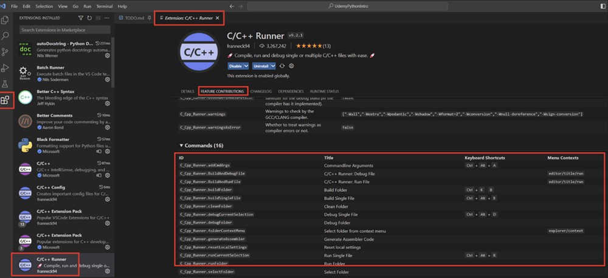

# C/C++ Runner Extension

## Single FIle

### Windows and Linux

- Compile (Build) Single File: Ctrl+Alt+B
- Execute (Run) Single File: Ctrl+Alt+R

### MacOS

For MacOS keybindings see here:



### Windows User with MSVC Compiler

Set this locally:

```json
"C_Cpp_Runner.useMsvc": true,
```
